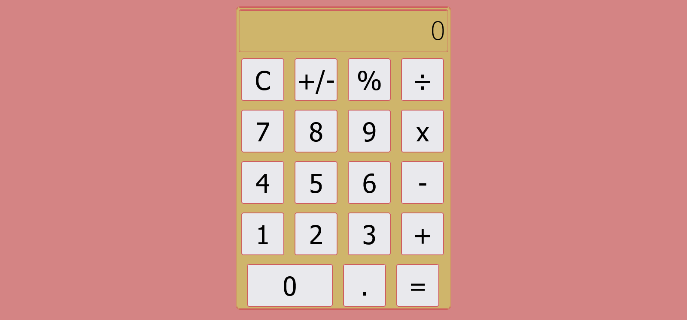

# Calculator

[Live](https://resplendent-kitsune-ed844d.netlify.app)

## Technologies

- JavaScript
- HTML5
- CSS
- Vite

### The challenge

- structuring & Designing the page
- take an inputs from users by calculator’s keyboard
- use Math and Number object and their functions
- show answer on calculator’s screen

### What I have learned was how to:

- math objects and their mathematical functions
- use Number object
- use Math object
- work with Vite
- DOM Selection
